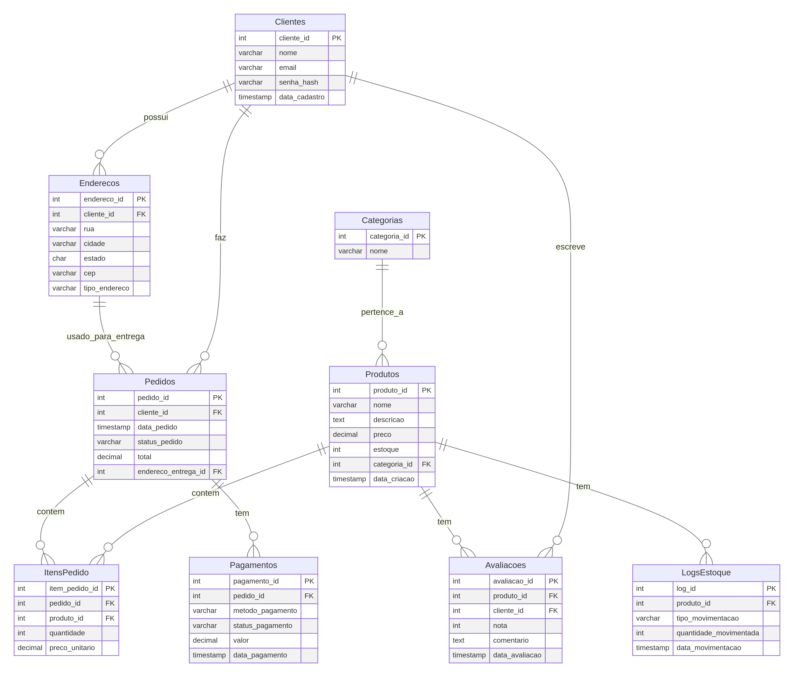

# Projeto de Banco de Dados: Sistema de E-commerce

Este repositório contém um projeto de banco de dados completo, modelado para um sistema de **E-commerce** robusto. O objetivo é demonstrar proficiência em **Modelagem de Dados**, **SQL** (Structured Query Language) em diferentes níveis de complexidade e técnicas de **Otimização de Performance**.

## Estrutura do Projeto

O projeto está organizado nos seguintes arquivos:

| Arquivo | Descrição | Foco Principal |
| :--- | :--- | :--- |
| `schema.sql` | Script SQL para criação de todas as tabelas (DDL - Data Definition Language). | Modelagem, Integridade Referencial |
| `data.sql` | Script SQL para inserção de dados de exemplo (DML - Data Manipulation Language). | Dados de Teste, Cenários de Negócio |
| `queries.sql` | Coleção de consultas SQL de Nível 1 a Nível 4, incluindo `JOIN`s, `GROUP BY`, Subconsultas e Funções de Janela. | Proficiência em SQL, Análise de Dados |
| `optimization.sql` | Exemplos de criação de `INDEX`es estratégicos e `VIEW`s, além de um esboço de `Stored Procedure` para transações. | Performance, Otimização, Lógica de Negócio |
| `ecommerce_erd.mmd` | Código-fonte do Diagrama de Entidade-Relacionamento (DER) em formato Mermaid. | Modelagem Conceitual |
| `ecommerce_erd.png` | Imagem gerada a partir do DER, para visualização rápida. | Documentação Visual |

## Modelagem de Dados (Diagrama Entidade-Relacionamento)

O modelo de dados foi projetado para suportar as operações centrais de um e-commerce, incluindo:

*   **Clientes** e seus **Endereços** (separados para flexibilidade de entrega e cobrança).
*   **Produtos** organizados por **Categorias**.
*   **Pedidos** e seus **ItensPedido** (relação muitos-para-muitos).
*   **Avaliações** de produtos por clientes.
*   Rastreamento de **Pagamentos**.
*   **Logs de Estoque** para auditoria.

O diagrama abaixo ilustra as entidades e seus relacionamentos:

## Destaques de SQL e Otimização

### 1. Consultas Complexas (`queries.sql`)

O arquivo `queries.sql` demonstra a capacidade de extrair informações de negócio complexas, como:

*   Cálculo do valor total de vendas por categoria.
*   Identificação de clientes recorrentes (`HAVING COUNT(*) > 1`).
*   Uso de **Funções de Janela** (`RANK() OVER (PARTITION BY...)`) para classificar produtos por preço dentro de suas categorias.

### 2. Otimização de Performance (`optimization.sql`)

O foco em performance é demonstrado através de:

*   **Índices Compostos**: Criação de índices como `idx_produtos_categoria_preco` para otimizar buscas e ordenações comuns.
*   **Views**: Utilização de `HistoricoPedidosDetalhado` para simplificar consultas recorrentes e abstrair a complexidade dos `JOIN`s.
*   **Stored Procedures (Conceitual)**: Demonstração de como encapsular a lógica transacional (criação de pedido, atualização de estoque, log) para garantir a atomicidade e integridade dos dados.

## Como Usar

1.  **Crie o Banco de Dados:** Utilize o `schema.sql` em um SGBD compatível (PostgreSQL, MySQL, etc.) para criar as tabelas.
2.  **Popule os Dados:** Execute o `data.sql` para inserir os dados de exemplo.
3.  **Explore:** Execute as consultas em `queries.sql` e `optimization.sql` para ver os resultados e entender a lógica.

Este projeto é um excelente ponto de partida para demonstrar suas habilidades em banco de dados em entrevistas técnicas.
